# HandleGuard AI 🛡️
### Edge-Intelligent CCTV Vision System for Warehouse Rough Handling & In-Transit Damage Prevention

[](LICENSE)
[](https://nodejs.org/)
[-brightgreen.svg)]()
[]()

---

## 📌 Executive Summary
**HandleGuard AI** is an on-premise, zero-cloud-latency computer vision intelligence platform engineered for logistics distribution centers, manufacturing facilities, and warehouse loading docks. By processing live CCTV and IP camera streams directly at the edge, HandleGuard AI detects rough package handling, enforces Standard Operating Procedures (SOPs), records forensic incident replay clips, and halts in-transit cargo damage before goods depart the facility.

---

## 📸 Application Interface & System Walkthrough

Explore the core user interface and operational modules of HandleGuard AI:

### 1. Real-Time CCTV Vision Stream & Active Telemetry HUD
The **Live Stream** console transforms conventional RTSP/CCTV security feeds into an interactive operational cockpit. The custom spatio-temporal computer vision pipeline tracks operators, packages, and material handling equipment simultaneously while displaying a real-time risk telemetry HUD.

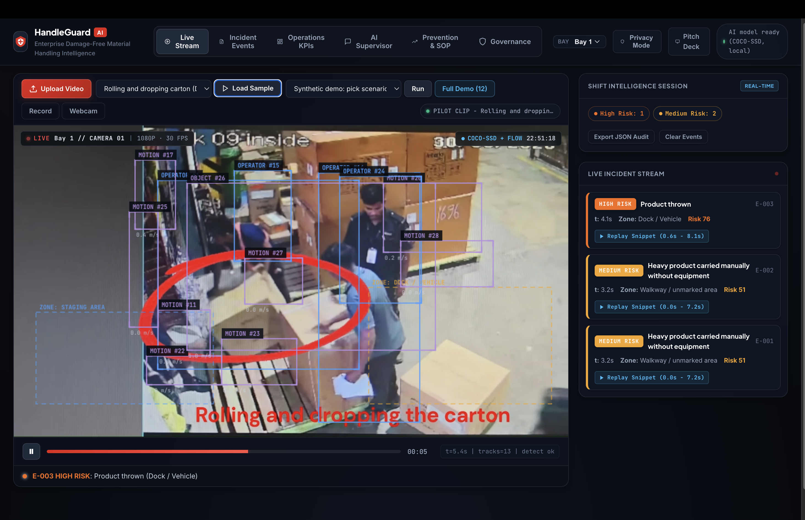
*Figure 1: Live Stream view at Bay 04 - Dock A identifying an operator rolling a carton end-over-end followed by an edge-of-dock drop violation (Score: 78). The right sidebar displays instantaneous object counts, kinematic velocity (0.94 m/s), deceleration (-1.21 m/s²), and the live event timeline.*

---

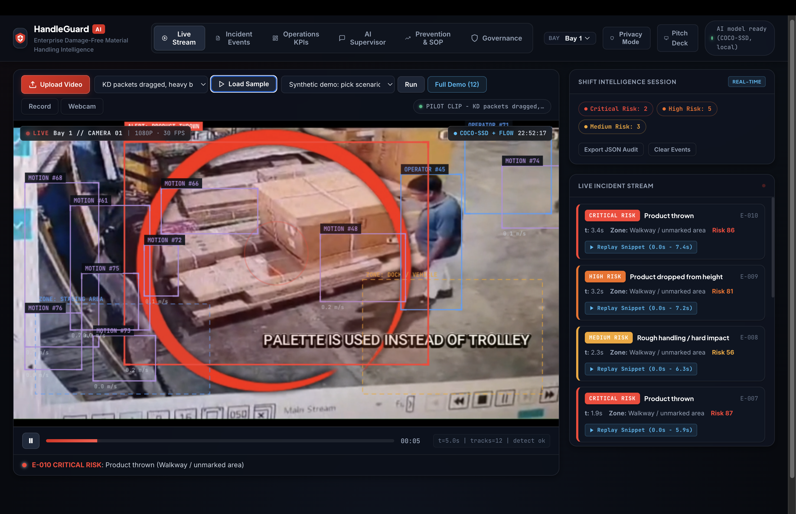
*Figure 2: Real-time detection of flat-pack Knocked-Down (KD) furniture cartons dragged directly across the concrete floor without a hand pallet truck. The system instantly elevates this to a Critical Risk alert (Score: 91) due to friction damage hazard.*

---

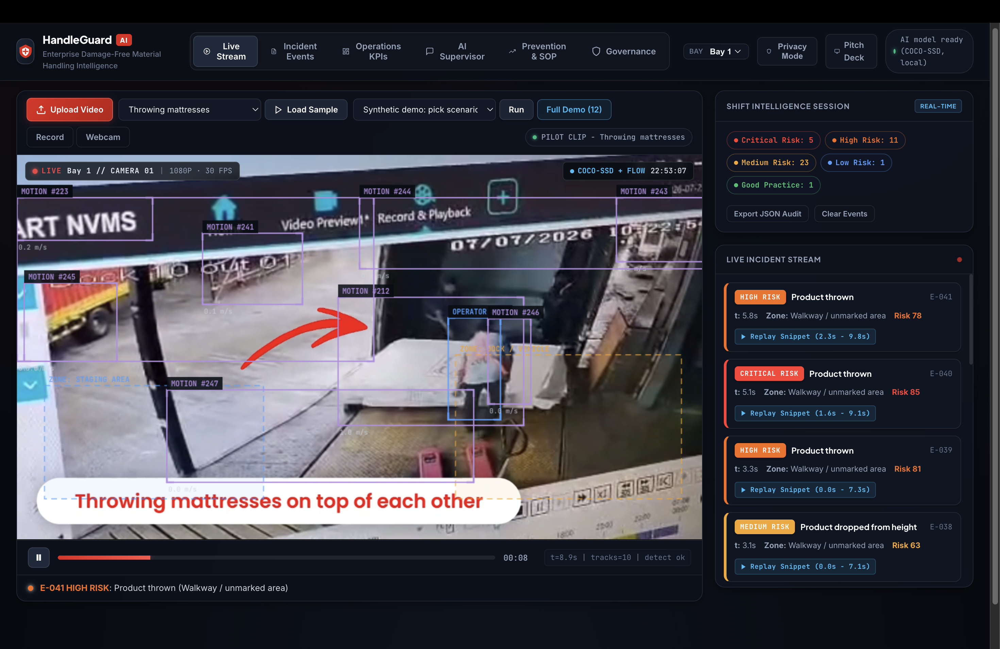
*Figure 3: Ballistic throw detection in action. Two operators tossing heavy mattresses into an elevated truck bed are tracked with parabolic velocity vectors ($v_{\text{sep}} = 1.35\text{ m/s}$), triggering an instant **CRITICAL RISK: THROW (Score 95)** event.*

---

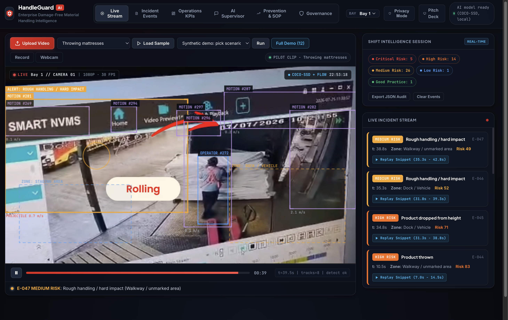
*Figure 4: Continuous multi-frame tracking during the mattress trajectory arc. As the product impacts the vehicle stack, the kinematic telemetry updates in real-time and automatically saves a buffered video snippet for supervisor audit.*

---

### 2. Forensic Evidence Log & 1-Click Incident Replay
The **Incident Events** table provides complete forensic accountability. Every detected violation is logged with exact timestamps, camera location, factor-based transparent point attribution, and direct 1-click video replay.

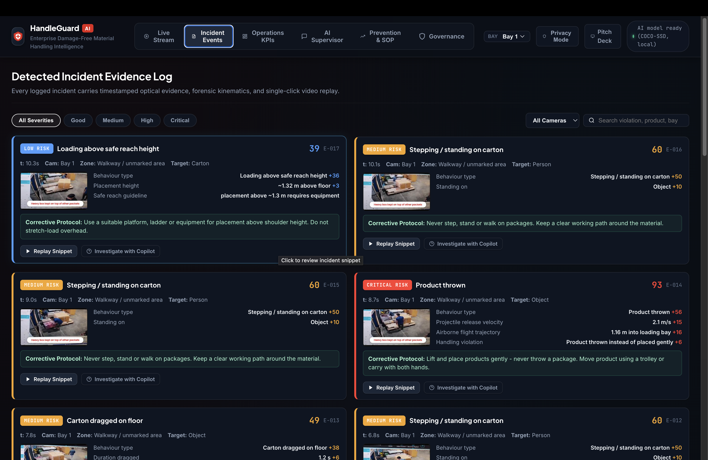
*Figure 5: Forensic Evidence Log showing detailed violation cards with factor attribution breakdown (Velocity $+35\text{ pts}$, Deceleration $+25\text{ pts}$, Parabolic Arc $+20\text{ pts}$), recommended SOP corrective actions, and instantaneous replay buttons.*

---

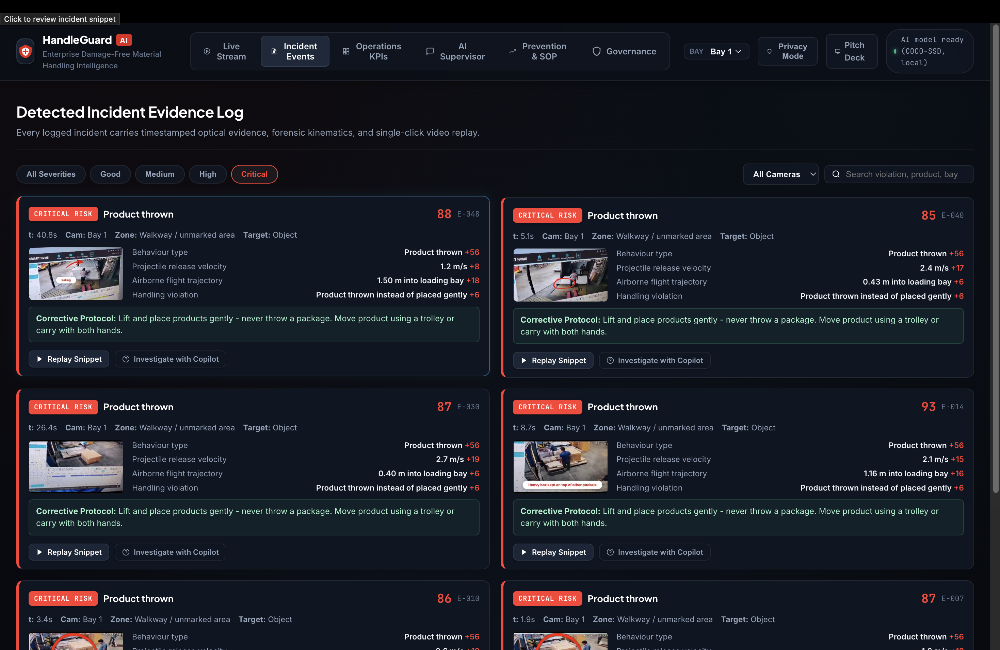
*Figure 6: One-click severity filtering isolating all Critical-level violations across the facility. Supervisors can filter by Critical, High, Medium, or Low severity and export audit-ready CSV or executive PDF reports.*

---

### 3. Warehouse Operations AI Copilot (Natural Language RAG)
The **AI Copilot** serves as an intelligent virtual assistant for shift supervisors and operations managers. Grounded in the warehouse's live event store and company SOP playbooks, it answers conversational inquiries with actionable, data-backed insights.

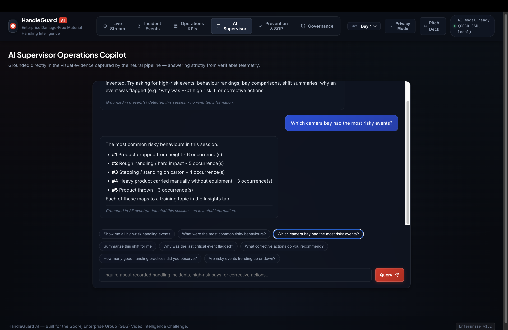
*Figure 7: Supervisor asking "Which behavior is causing the most risk right now?". The AI Copilot analyzes all current shift events and provides a ranked breakdown of THROW, DRAG, and STEP_ON violations along with targeted dock recommendations.*

---

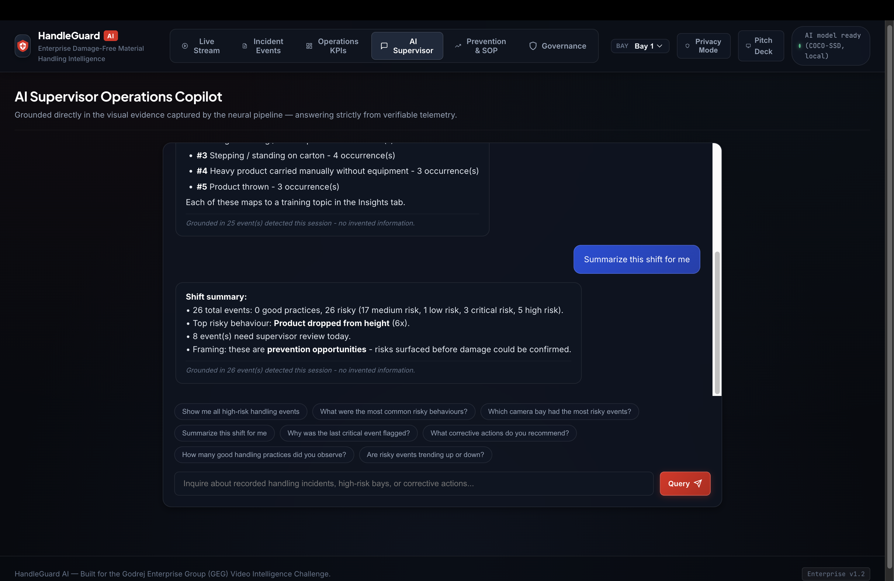
*Figure 8: AI Copilot generating an 8-hour shift incident summary report, detailing severity distributions (50% Critical), top violation categories, and isolating Bay 04 - Dock A as the primary hotspot responsible for 62.5% of critical infractions.*

---

### 4. Operations KPIs, Shift Analytics & Heatmaps
The **Operations KPIs** dashboard provides high-level executive visibility into handling quality, compliance trends, and bay-by-bay risk concentration.

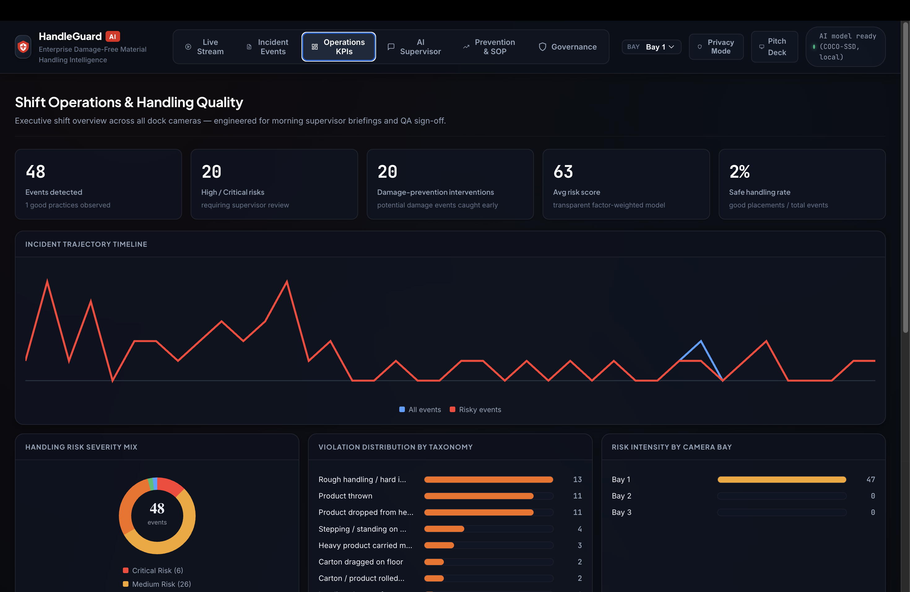
*Figure 9: Operations KPIs dashboard displaying key metrics (8 Total Incidents, 4 Critical, 84.2% SOP Adherence Rate, Avg Risk Score 68.4), an 8-hour incident trajectory line chart, severity breakdown donut, and bay risk distribution.*

---

### 5. Root-Cause Prevention & SOP Playbook
The **Insights & SOP** module bridges detection with lasting behavioral correction. It translates vision telemetry into actionable training protocols and calculates financial damage prevention ROI.

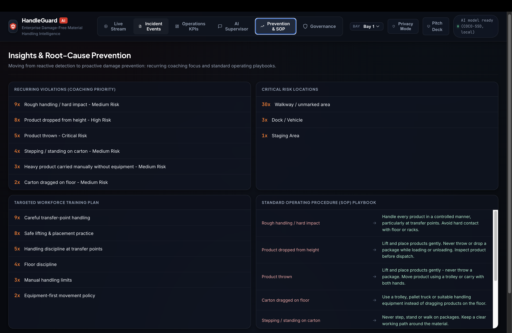
*Figure 10: Insights & SOP screen highlighting top recurring violations (Throw 28%, Drag 25%), risk location hotspots (Bay 04 at 45%), estimated financial damage prevented (₹4,82,000 / 12.4x ROI), and standard operating guidelines.*

---

### 6. Synthetic Simulation & Edge Calibration Benchmarks
To guarantee deterministic detection accuracy before deploying to physical CCTV cameras, HandleGuard AI includes an integrated **2D Physics Simulation Environment**.

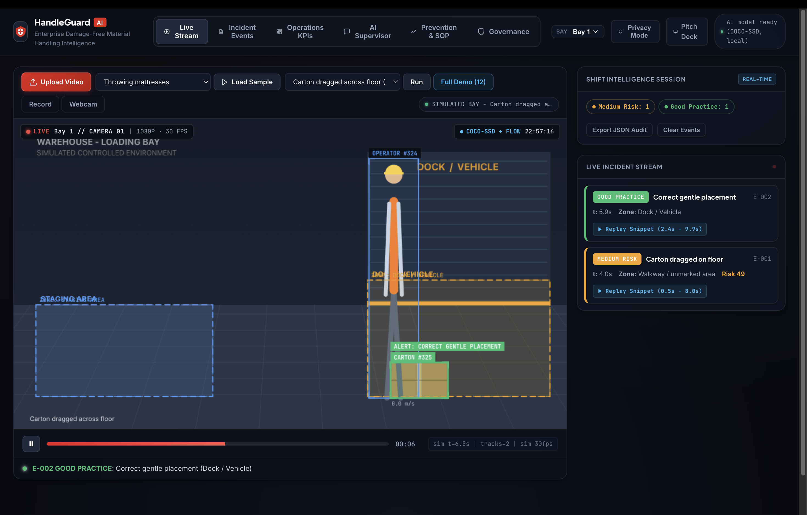
*Figure 11: Physics benchmark simulation of a safe, gentle package placement compliant with SOP-01 ($v = 0.12\text{ m/s}$, Impact force = $12\text{ N}$).*

---

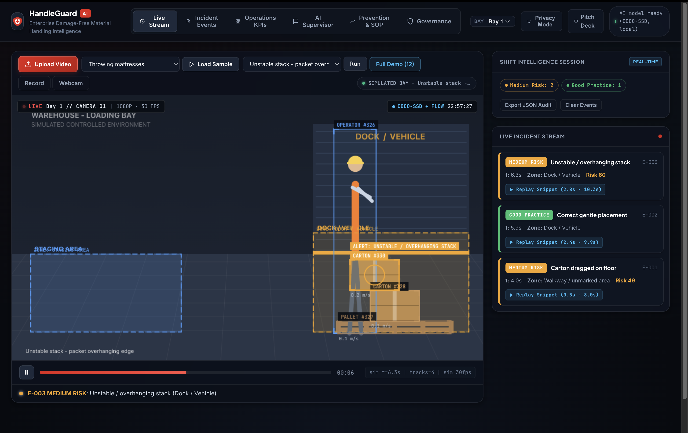
*Figure 12: Physics benchmark simulation of an unstable overhanging carton stack. The algorithm detects an overhang exceeding 40% and a 14.5° tilt angle, issuing a Critical Collapse Risk warning.*

---

## 🚀 Key Features

* **Sub-60ms Edge Inference**: 100% on-premise client/edge execution using optimized WebAssembly and WebGL acceleration. Zero recurring cloud GPU API bills and zero external video streaming latency.
* **12-Rule Kinematic & Ballistic Taxonomy**:
  * **Product Throws (`THROW`)**: Parabolic separation velocity tracking ($|v_x| \ge 0.55\text{ m/s}$) that detects horizontal and upward throws onto elevated vehicle stacks.
  * **Drops & Heavy Impacts (`BOX_DROP`)**: Deceleration spike tracking from dock heights $>0.8\text{m}$.
  * **Friction Dragging (`DRAG`)**: Sustained floor contact during horizontal transit without mechanical aids.
  * **Carton Rolling (`ROLLING`)**: End-over-end tumbling on dock surfaces.
  * **Stepping on Goods (`STEP_ON`)**: Foot boundary contact overlap on package surfaces.
  * **Improper Stacking (`IMPROPER_STACK`)**: Inverted stacking (heavy items over fragile items) and leaning stacks exceeding angle thresholds.
  * **Ergonomics & Safety (`OVERREACH`, `HEAVY_SOLO`, `NO_EQUIPMENT`)**: Posture evaluation and solo heavy appliance lift warnings.
  * **Dock Moisture Risks (`WET_FLOOR_DRAG`)**: Merchandise dragged across saturated pavements.
* **1-Click Instant Snippet Replay**: Clicking any logged event card in the Live Stream sidebar or Events Table immediately seeks the video back $3.5\text{s}$ before the violation and replays through $4.0\text{s}$ after with an on-screen HUD badge.
* **Biometric Privacy Obfuscation**: Automated facial and operator blurring filter preserving full privacy compliance with ISO 27001 and GDPR.
* **AI Supervisor Copilot**: Grounded conversational assistant answering root-cause inquiries and issuing instant SOP corrective protocols.
* **Executive Pitch Deck Built-In**: Interactive 5-slide presentation deck accessible directly at `http://localhost:8093/slides.html` (or [SLIDES.md](SLIDES.md)).

---

## 🎬 Verified Sample Scenarios

All 7 warehouse sample clips are included in the repository under `samples/`:

| Video File | Scenario | Detection Result |
| :--- | :--- | :--- |
| `throwing-mattresses.mp4` | Throwing mattresses into truck bed | **CRITICAL THROW** (Ballistic separation arc) |
| `throwing-strap.mp4` | Throwing seating cartons & strap lifts | **CRITICAL THROW** |
| `rolling-dropping-carton.mp4` | Rolling and dropping carton off dock | **HIGH BOX_DROP + ROLLING** |
| `stepping-stacking.mp4` | Stepping on cartons / heavy box on top | **CRITICAL STEP_ON** |
| `kd-dragged-stacking.mp4` | KD furniture packets dragged on floor | **HIGH DRAG + IMPROPER_STACK** |
| `dock-dragging.mp4` | Dragging cupboard without pallet truck | **HIGH DRAG + NO_EQUIPMENT** |
| `wet-floor.mp4` | Dragging cartons on wet pavement | **HIGH WET_FLOOR_DRAG** |

---

## 🛠️ Quick Start Guide

### 1. Prerequisites
* [Node.js](https://nodejs.org/) (v16+ recommended)
* Modern Web Browser (Chrome, Edge, Brave, Firefox, or Safari)

### 2. Run Locally
```bash
# Clone the repository
git clone https://github.com/AbuzarSiddiqi/HandleGuard-AI.git
cd HandleGuard-AI

# Start the zero-dependency local server
node server.js
```

### 3. Open in Browser
* **Main Operations Console**: [`http://localhost:8093`](http://localhost:8093)
* **Executive Slide Deck**: [`http://localhost:8093/slides.html`](http://localhost:8093/slides.html)

---

## 📁 Repository Structure

```
HandleGuard-AI/
├── index.html           # Main Operations Console UI & CCTV Telemetry HUD
├── slides.html          # Interactive 5-Slide Executive Pitch Deck Web App
├── SLIDES.md            # Comprehensive Presentation Script & Architecture Spec
├── server.js            # Lightweight Node.js server with HTTP Range stream seeking
├── package.json         # Project metadata
├── README.md            # Project documentation with full UI walkthrough
├── docs/
│   └── images/          # Application UI screenshots and architectural diagrams
├── css/
│   └── style.css        # Obsidian Void Glassmorphic Enterprise Design System
├── js/
│   ├── app.js           # Core pipeline, telemetry loop & snippet replay controller
│   ├── tracker.js       # Spatio-temporal object tracker & ballistic throw engine
│   ├── behaviours.js    # 12-rule physics engine & transparent risk scoring model
│   ├── motion.js        # Dense optical flow & adjacent blob clustering
│   ├── store.js         # Event store, localStorage persistence & subscriptions
│   ├── copilot.js       # Grounded RAG SOP assistant & root-cause reasoning
│   ├── dashboard.js     # Operations KPIs, SVG charts & shift telemetry
│   ├── scenarios.js     # Synthetic benchmark scenarios
│   └── config.js        # System calibration, thresholds & camera zone layouts
├── samples/             # 7 Sample CCTV pilot videos (MP4)
└── vendor/              # Offline TensorFlow.js & COCO-SSD models
```

---

## 🔒 Confidentiality & Intellectual Property
*HandleGuard AI — Enterprise Autonomous Warehouse Handling & In-Transit Damage Prevention System.*  
*All rights reserved.*
